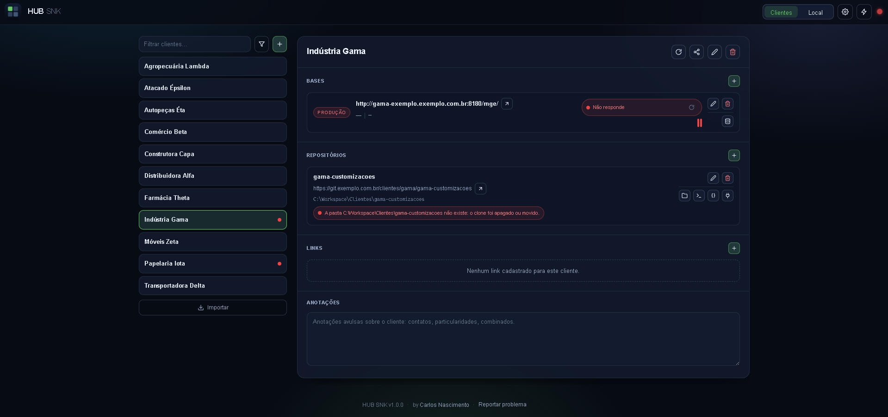

# HUB SNK

[](https://github.com/CarlosSimao/hub-snk/releases)
[](LICENSE)
[](https://nodejs.org)

Hub local de cadastro de clientes, das bases e dos repositórios Git de cada
um. Roda na sua máquina, sem Docker, sem banco de dados e sem autenticação, e
abre em janela própria — como um aplicativo de desktop.

Funciona em Windows, Linux e macOS.



---

## Windows

Baixe o `hub-snk-<versão>-windows-x64.zip` na
[página de releases](https://github.com/CarlosSimao/hub-snk/releases) e
descompacte.

### Usar sem instalar

Abra a pasta descompactada, clique com o botão direito num espaço vazio dela e
escolha _Abrir no Terminal_. Depois:

```powershell
.\node.exe src\index.ts
```

O servidor sobe e a janela do HUB SNK abre sozinha, sem barra de endereço e sem
abas. Para encerrar, feche o terminal.

Não é preciso ter Node.js instalado — o pacote traz o dele. Seu cadastro fica na
pasta `dados-hub-snk`, ao lado do programa; para mandá-lo a outro lugar, use o
`HUB_DADOS_DIR` (veja [Configuração](#configuração)).

> **Por que sem instalador:** o Controle Inteligente de Aplicativos do Windows 11
> bloqueia executável e script sem assinatura digital, e assinar exige
> certificado pago. O `node.exe` do pacote é assinado pela OpenJS Foundation e
> passa direto — por isso o caminho acima funciona com o bloqueio ligado.

### Instalar, com atalho e início no logon

O pacote também traz uma instalação de verdade, para quem quer ícone no menu
Iniciar e o servidor subindo junto com o Windows.

Os scripts são barrados pelo Controle Inteligente de Aplicativos enquanto
carregarem a marca de arquivo baixado da internet. Para tirá-la, **antes de
descompactar**: botão direito no `.zip` → _Propriedades_ → marque
**Desbloquear** → _OK_. Só então descompacte e dê duplo clique em
**`instalar-hub-snk.bat`**.

Cada pergunta vem com um valor pronto entre colchetes, e Enter aceita:

| Pergunta                    | Padrão                           | O que faz                                                                                       |
| --------------------------- | -------------------------------- | ----------------------------------------------------------------------------------------------- |
| Pasta de instalação         | `%LOCALAPPDATA%\Programs\HubSnk` | Onde o programa fica                                                                            |
| `HUB_PORTA`                 | `4100`                           | Porta em que o servidor escuta                                                                  |
| `HUB_HOST`                  | `127.0.0.1`                      | Endereço em que o servidor escuta                                                               |
| `HUB_DADOS_DIR`             | `%LOCALAPPDATA%\HubSnk\dados`    | Onde o cadastro é gravado                                                                       |
| `HUB_NAVEGADOR`             | Edge, se houver                  | Edge, Chrome ou o navegador padrão — é nele que a janela e os links dos clientes abrem          |
| Atalho na área de trabalho  | Sim                              | Ícone do HUB SNK ao lado do menu Iniciar                                                        |
| Iniciar junto com o Windows | Não                              | O servidor sobe sozinho no logon, sem abrir janela. Você abre a tela quando quiser, pelo atalho |

As escolhas ficam em `%LOCALAPPDATA%\HubSnk\hub-snk.env`, um arquivo de texto
que dá para editar depois sem reinstalar.

O atalho abre o HUB SNK em **janela própria**, sem barra de endereço e sem abas
— usa o Edge ou o Chrome escolhido na instalação, sem precisar instalar a PWA
pelo botão do navegador. Só são oferecidos os navegadores encontrados na
máquina; se o escolhido for desinstalado depois, o HUB SNK volta a abrir no
primeiro que encontrar.

Seu cadastro fica fora da pasta do programa. Desinstalar **não apaga o
cadastro**; atualizar também não.

### Atualizar no Windows

Baixe o zip da versão nova e descompacte. Sem instalação, é só rodar o
`.\node.exe src\index.ts` da pasta nova. Com instalação, rode o
`instalar-hub-snk.bat` de novo: ele encerra o servidor no ar, escreve por cima e
mantém as respostas anteriores como padrão — Enter em tudo repete a instalação
atual.

### Desinstalar no Windows

Rode o `desinstalar-hub-snk.bat` de dentro da pasta em que o HUB SNK foi
instalado. Ele encerra o servidor, remove atalhos e programa, e deixa o cadastro
onde está.

---

## Linux e macOS

Baixe o pacote da sua plataforma na
[página de releases](https://github.com/CarlosSimao/hub-snk/releases):

| Plataforma                             | Arquivo                               |
| -------------------------------------- | ------------------------------------- |
| Linux                                  | `hub-snk-<versão>-linux-x64.tar.gz`   |
| macOS com Apple Silicon (M1 em diante) | `hub-snk-<versão>-macos-arm64.tar.gz` |
| macOS com processador Intel            | `hub-snk-<versão>-macos-x64.tar.gz`   |

### Usar sem instalar

```bash
tar -xzf hub-snk-*-linux-x64.tar.gz
cd hub-snk-*-linux-x64
./hub-snk.sh            # sobe o servidor e abre a janela
./hub-snk.sh servidor   # sobe o servidor sem abrir nada
./hub-snk.sh parar      # encerra o servidor
```

O pacote **já traz o Node** — não é preciso ter Node.js instalado.

### Instalar, com atalho e início na sessão

```bash
./instalar-hub-snk.sh
```

Pergunta a pasta do programa, os quatro parâmetros do servidor (`HUB_PORTA`,
`HUB_HOST`, `HUB_DADOS_DIR`, `HUB_NAVEGADOR`), se cria atalho no menu de
aplicativos e se sobe junto com a sessão. Cada pergunta vem com o valor pronto
entre colchetes, e Enter aceita. As respostas ficam em
`~/.config/hub-snk/hub-snk.env`, editável depois sem reinstalar.

Seu cadastro fica em `~/.local/share/hub-snk/dados`, fora da pasta do programa.
Para atualizar, descompacte a versão nova e rode o `instalar-hub-snk.sh` de
novo; o cadastro fica onde está. Para remover, rode o `desinstalar-hub-snk.sh`
de dentro da pasta instalada.

> No macOS, a primeira execução pode ser barrada pelo Gatekeeper, porque o
> pacote não é assinado. Libere em _Ajustes do Sistema_ › _Privacidade e
> Segurança_, ou rode `xattr -dr com.apple.quarantine .` dentro da pasta.

---

## Configuração

Todas as variáveis são opcionais.

| Variável            | Padrão            | O que faz                                                                                                                                       |
| ------------------- | ----------------- | ----------------------------------------------------------------------------------------------------------------------------------------------- |
| `HUB_PORTA`         | `4100`            | Porta do servidor                                                                                                                               |
| `HUB_HOST`          | `127.0.0.1`       | Interface de escuta. Endereço fora do loopback só é aceito junto com `HUB_PERMITIR_REDE=1` — leia [Exposição na rede](#exposição-na-rede) antes |
| `HUB_PERMITIR_REDE` | _(vazio)_         | `1` autoriza o `HUB_HOST` fora do loopback. Sem ela, o servidor recusa subir                                                                    |
| `HUB_DADOS_DIR`     | `./dados-hub-snk` | Onde o cadastro é gravado                                                                                                                       |
| `HUB_NAVEGADOR`     | _(vazio)_         | Navegador da janela: no Windows `edge`, `chrome` ou `padrao`; no Linux e no macOS o comando do navegador, `auto` ou `padrao`                    |
| `HUB_ABRIR_JANELA`  | _(vazio)_         | `0` sobe o servidor sem abrir a janela. É o que o launcher usa, porque a janela é ele quem abre                                                 |

Numa instalação, esses mesmos nomes ficam gravados no `hub-snk.env` — em
`%LOCALAPPDATA%\HubSnk\` no Windows, em `~/.config/hub-snk/` no Linux e no
macOS. O launcher lê o arquivo a cada abertura, e a variável de ambiente de
mesmo nome vence o que está gravado: dá para testar outra porta ou outro
navegador sem reinstalar.

Exemplo — gravar os dados em outro disco, editando o `hub-snk.env`:

```
HUB_DADOS_DIR=D:\HubSnk
```

Feche a janela do HUB SNK e abra de novo pelo atalho: o launcher lê o arquivo a
cada abertura.

Apontar para dentro de uma pasta de nuvem é o que dá backup — veja
[Backup na nuvem](docs/funcionalidades.md#backup-na-nuvem).

---

## Exposição na rede

O HUB SNK escuta só em `127.0.0.1`, e a razão é o que ele faz: **não tem
autenticação**, devolve o cadastro inteiro — senhas em texto puro incluídas — a
quem pedir, e abre programas do seu computador (IntelliJ, DataGrip, terminal,
gerenciador de arquivos) a pedido de quem chama a API.

Escutar fora do loopback junta as três coisas: qualquer máquina que alcance a
porta lê as senhas de todos os clientes e manda a sua máquina executar
programas. Por isso um endereço de rede só sobe com a permissão dita de
propósito:

```
# Recusado — o servidor nem inicia
HUB_HOST=0.0.0.0
HUB_PERMITIR_REDE=0

# Aceito, com o risco assumido
HUB_HOST=0.0.0.0
HUB_PERMITIR_REDE=1
```

A instalação pergunta isso na hora: um endereço fora do loopback só é gravado
depois de o script mostrar o que a exposição significa e você confirmar.

No modo padrão, o HUB SNK ainda confere se cada requisição veio mesmo da própria
janela dele, e recusa o resto — inclusive um site aberto no seu navegador
tentando falar com o programa. Com `HUB_PERMITIR_REDE=1` essa conferência é
desligada, e o servidor avisa isso no terminal ao subir. Como a conferência
funciona está em [docs/api.md](docs/api.md#conferência-de-origem).

---

## Onde ficam os dados

Tudo o que você cadastra fica na pasta `dados-hub-snk/`, ao lado do projeto — ou
onde o `HUB_DADOS_DIR` apontar. São três arquivos: o cadastro de clientes, a
configuração global e as bases e bancos da própria máquina.

A pasta está no `.gitignore`, então o cadastro nunca vai junto num commit. O
formato dos arquivos está em [docs/formato-dos-dados.md](docs/formato-dos-dados.md).

---

## Funcionalidades

| O quê                       | Resumo                                                                                                                           |
| --------------------------- | -------------------------------------------------------------------------------------------------------------------------------- |
| **Cadastro de clientes**    | Bases do ERP com usuário, senha e banco vinculado, repositórios Git, links avulsos e anotações livres                            |
| **Importação de favoritos** | Transforma favoritos do Chrome, Edge, Opera, Firefox ou Safari em bases, deduzindo Produção ou Teste do nome                     |
| **Botões do repositório**   | Abrem a pasta, o terminal (rodando o script padrão) e o IntelliJ; e editam o `.sankhya-mcp.env` do MCP Claude                    |
| **Atalhos**                 | Lista de programas da sua máquina, iniciados com um clique pelo botão de raio                                                    |
| **Bases locais (Local)**    | Ligam, param e reiniciam o WildFly da sua máquina, com a situação do serviço, o log ao vivo e o `.sankhya-mcp.env` da instalação |
| **Bancos locais (Local)**   | Ligam, param e reiniciam o container Docker do banco, conferindo se ele responde login com as credenciais cadastradas            |
| **Diagnóstico Git**         | Selo por repositório com a branch e a pendência mais grave — commit faltando, conflito, segredo rastreado —, atualizado sozinho  |
| **Backup na nuvem**         | Não é embutido: aponte a pasta de dados para o Drive, o OneDrive ou o Dropbox que você já usa                                    |

As bases e os bancos locais ficam no botão **Local**, no topo da tela, ao lado de
_Clientes_: é o ambiente de desenvolvimento da sua própria máquina, separado do
cadastro dos clientes. Ligar o banco sobe o Docker Desktop antes, se ele estiver
parado, e parar o WildFly usa o desligamento limpo do próprio servidor, não um
encerramento forçado.

Cada uma em detalhe, com as regras e o que muda em cada sistema operacional, em
[docs/funcionalidades.md](docs/funcionalidades.md).

> Os arquivos da pasta de dados sobem para a nuvem **como estão no disco**, e o
> cadastro guarda as senhas das bases e dos bancos em texto puro. Confira se a
> pasta não está compartilhada com ninguém.

---

## Solução de problemas

| Sintoma                                                  | O que fazer                                                                                                    |
| -------------------------------------------------------- | -------------------------------------------------------------------------------------------------------------- |
| `EADDRINUSE` ao iniciar                                  | A porta já está ocupada. Mude o `HUB_PORTA` no `hub-snk.env` e abra de novo                                    |
| A janela abre em aba comum, e não em janela própria      | O navegador escolhido saiu da máquina. Rode a instalação de novo e escolha outro                               |
| A tela abre, mas a atualização que eu baixei não aparece | A janela instalada está servindo o cache antigo. Recarregue com `Ctrl`+`Shift`+`R`, ou abra no navegador comum |
| Os botões de Git não fazem nada                          | O `git` precisa estar no PATH. Confira com `git --version` num terminal novo                                   |
| Mensagem sobre esquema mais novo ao iniciar              | O cadastro foi gravado por uma versão mais nova do HUB SNK. Instale a versão mais recente                      |
| `403` em tudo, ou a tela não carrega nada                | O endereço usado não é `127.0.0.1` nem `localhost`, ou a porta não bate com a do servidor                      |

Se não estiver na lista, [abra uma issue](https://github.com/CarlosSimao/hub-snk/issues/new/choose)
— citando a versão que aparece no rodapé da tela, e sem colar senha, host,
usuário ou nome de cliente: o repositório é público.

---

## Documentação técnica

Nada disto é necessário para usar o HUB SNK.

- [Funcionalidades em detalhe](docs/funcionalidades.md) — cada recurso, com as regras e o que muda em cada sistema
- [API HTTP](docs/api.md) — as rotas, os corpos aceitos e a conferência de origem
- [Formato dos arquivos de dados](docs/formato-dos-dados.md) — o envelope, o esquema e a migração
- [Distribuição](docs/distribuicao.md) — como os pacotes e os scripts de instalação são montados
- [Estrutura do código](docs/estrutura-do-codigo.md) — mapa dos arquivos
- [Manutenção](docs/manutencao.md) — modo de desenvolvimento, padrões do código, regra de versão e publicação
- [CHANGELOG](CHANGELOG.md) — o que mudou em cada versão

---

## Licença

[MIT](LICENSE) — use, altere e distribua à vontade, sem garantia nenhuma.

## Autor

Feito por [Carlos Nascimento](https://github.com/CarlosSimao).
