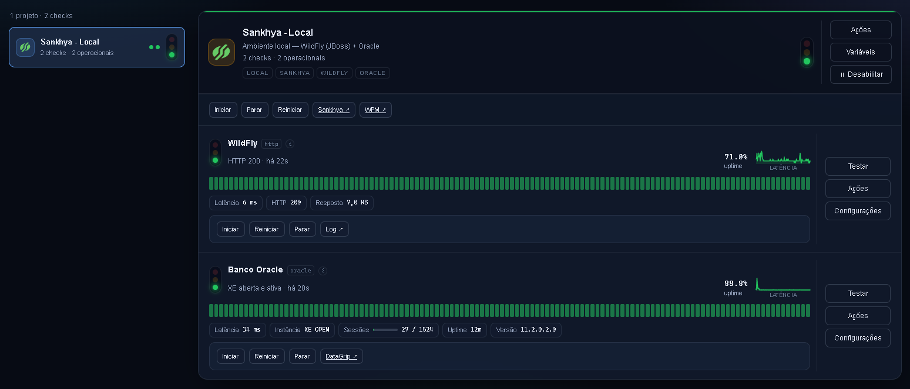

# sankhya-hub

Painel de monitoramento do ambiente **Sankhya local** — WildFly + Oracle na sua
máquina, com semáforos, indicadores e ações (iniciar/parar/reiniciar) disparadas pelo
próprio card.

---

## Pré-requisitos

| Item | Para quê |
|---|---|
| **Docker Desktop** (Windows) | O hub roda em container; é ele quem sobe o `sankhya-hub` |
| **WildFly do Sankhya instalado localmente** | `C:\Sankhya\wildfly_producao\bin\standalone.bat` — o hub controla o processo, não o instala |
| **Oracle do Sankhya rodando em container Docker** | Neste ambiente o banco é o container `skdev-oracle`, no mesmo Docker Desktop do hub |
| **PowerShell 5.1** | Já vem no Windows — roda o atalho e os helpers do WildFly, sem instalar nada extra |

O hub roda **dentro de um container Linux**, então alvos na sua máquina (WildFly,
Oracle) são alcançados por `host.docker.internal`, nunca `localhost`.

---

## Instalação

```bash
docker compose up -d --build
```

Painel em <http://localhost:4000>. Não existe arquivo de configuração para editar
antes — as credenciais do Oracle são preenchidas **no próprio painel**, no card
**Sankhya - Local**.

Para o dia a dia, o atalho `scripts\criar-atalho.ps1` cria **Sankhya Hub** no Desktop:
duplo clique sobe o Docker Desktop (se estiver parado), o container do hub e os
helpers nativos que controlam o WildFly, e abre o painel — tudo numa ação. Não roda
sozinho no `docker compose up`, precisa criar uma vez:

```powershell
powershell -ExecutionPolicy Bypass -File scripts\criar-atalho.ps1
```

---

## Usabilidade

Um card por projeto. O semáforo do topo é o **pior** status entre os checks; cada
check mostra o próprio histórico, latência e indicadores:



Neste projeto, dois checks bastam pra saber se o ambiente está de pé: **WildFly**
(responde no contexto `/mge/`) e **Banco Oracle** (conexão real ao XE, com
sessões/uptime/versão). Cada card tem botões de **Ações** (subir/parar/reiniciar
serviço e banco), **Testar** (roda o check na hora) e **Configurações** (intervalo e
timeout).

---

## Derrubar

```bash
docker compose down
```

O histórico fica no volume `monitor-data` e sobrevive. Para zerar também o histórico:
`docker compose down -v`.

