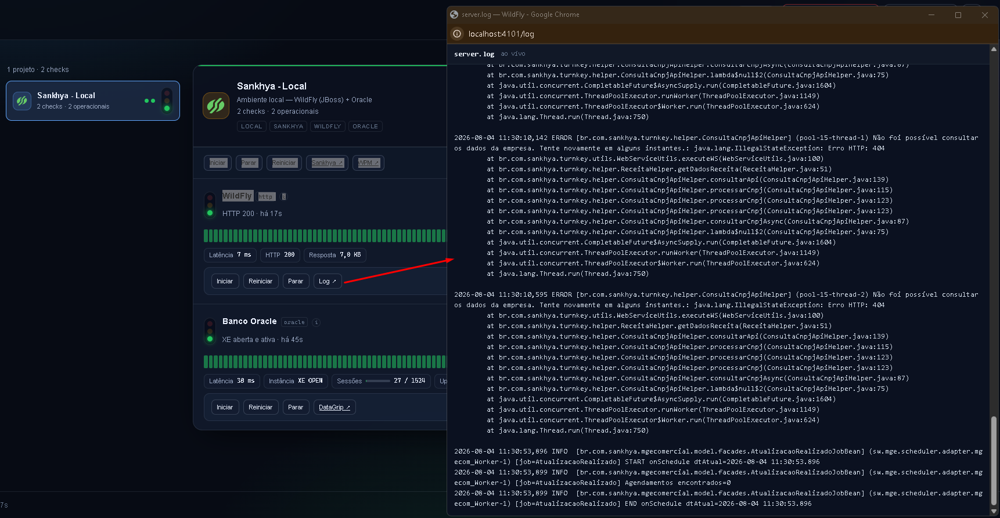

# sankhya-hub

Painel de monitoramento do ambiente **Sankhya local** — WildFly + Oracle na sua
máquina, com semáforos, indicadores e ações (iniciar/parar/reiniciar) disparadas pelo
próprio card.

---

## Pré-requisitos

| Item | Para quê |
|---|---|
| **Docker Desktop** (Windows) | O hub roda em container; é ele quem sobe o `sankhya-hub` |
| **WildFly do Sankhya instalado localmente** | `C:\Sankhya\wildfly_producao\bin\standalone.bat` (fallback `C:\wildfly_producao`) — o hub controla o processo, não o instala |
| **Oracle do Sankhya rodando em container Docker** | Neste ambiente o banco é o container `skdev-oracle`, no mesmo Docker Desktop do hub |
| **PowerShell 5.1** | Já vem no Windows — roda o atalho e os helpers do WildFly, sem instalar nada extra |

O hub roda **dentro de um container Linux**, então alvos na sua máquina (WildFly,
Oracle) são alcançados por `host.docker.internal`, nunca `localhost`.

---

## Instalação

```bash
docker compose up -d --build
```

Painel em <http://localhost:4000>. Não existe arquivo de configuração para editar
antes — as credenciais do Oracle são preenchidas **no próprio painel**, no card
**Sankhya - Local**.

Para o dia a dia, o atalho `scripts\criar-atalho.ps1` cria **Sankhya Hub** no Desktop:
duplo clique sobe o Docker Desktop (se estiver parado), o container do hub e os
helpers nativos que controlam o WildFly, e abre o painel — tudo numa ação. Não roda
sozinho no `docker compose up`, precisa criar uma vez:

```powershell
powershell -ExecutionPolicy Bypass -File scripts\criar-atalho.ps1
```

---

## Usabilidade

O painel tem três abas:

| Aba | O que faz |
|---|---|
| **Infra** | O monitoramento de sempre — WildFly, Oracle, containers |
| **Sankhya** | Cadastro dos clientes acompanhados e as credenciais do hub no Sankhya |
| **Git** | Repositórios do git-autosync: estado, agendamento, histórico e ações |

As abas Sankhya e Git dependem do `scripts/hub-helper.ps1` rodando no Windows (o
atalho do Desktop já o inicia). Sem ele, as duas explicam o que falta em vez de
quebrar; a aba Infra funciona normalmente de qualquer jeito.

Na aba Infra, um card por projeto. O semáforo do topo é o **pior** status entre os
checks; cada check mostra o próprio histórico, latência e indicadores:


Neste projeto, dois checks bastam pra saber se o ambiente está de pé: **WildFly**
(responde no contexto `/mge/`) e **Banco Oracle** (conexão real ao XE, com
sessões/uptime/versão). Cada card tem botões de **Ações** (subir/parar/reiniciar
serviço e banco), **Testar** (roda o check na hora) e **Configurações** (intervalo e
timeout).

Botão **Log** abre o `server.log` do WildFly ao vivo, direto no navegador:



---

## Derrubar

```bash
docker compose down
```

O histórico fica no volume `monitor-data` e sobrevive. Para zerar também o histórico:
`docker compose down -v`.

---

## Segurança

Ferramenta de uso pessoal/local, **sem autenticação em lugar nenhum** — decisão
explícita, não descuido:

- **Painel (porta 4000):** exposto só em `127.0.0.1` no `docker-compose.yml`. Não
  publique em `0.0.0.0`; quem alcançar essa porta reescreve credenciais salvas no
  cofre. Para acesso remoto, use túnel SSH.
- **Helpers do WildFly** (`scripts/wildfly-helper.ps1`, porta 4100, e
  `scripts/wildfly-log-helper.ps1`, porta 4101): escutam em **todas as interfaces**
  da máquina Windows, sem token. Qualquer dispositivo na mesma rede local consegue
  iniciar/parar/reiniciar o WildFly ou ler o `server.log`. Não exponha essas portas
  além da rede confiável.
- **Helper do hub** (`scripts/hub-helper.ps1`, porta 4102): também escuta em todas as
  interfaces — o container alcança o host por `host.docker.internal`, que não chega
  pelo loopback —, mas este **exige token** em toda rota, diferente dos dois acima. A
  razão é o que ele expõe: derrubar o WildFly pela rede é reversível, entregar a senha
  do Sankhya não é. O token é gerado no primeiro boot em
  `%APPDATA%\sankhya-hub\ipc\token.txt` e montado read-only no container.
- Segredos dos alvos monitorados (senha do Oracle, etc.) ficam só no volume
  `monitor-data` (cofre local), nunca no `services.yaml` versionado.
- Credenciais do **Sankhya ERP e Experience** são outra coisa: ficam cifradas com DPAPI
  em `%APPDATA%\sankhya-hub\credentials.dat`, **fora** do container e fora do volume
  Docker. Nenhuma rota do hub devolve essas senhas — só o backend as decripta, no
  momento de autenticar contra o Sankhya.
- O caminho preferido nem chega a guardar senha: o hub abre uma **janela de navegador
  própria** (perfil em `%APPDATA%\sankhya-hub\navegador`, separado do seu Chrome), você
  faz o login nela, e o hub lê só o cookie de sessão que sobra. A porta do DevTools
  (9222) fica em `127.0.0.1` e **não** é publicada para o container — quem fala com ela
  é o helper, e o hub recebe o resultado pela 4102, que exige token.

## Adaptando para sua máquina

`config/services.yaml` vem com o ambiente de exemplo do autor original — ajuste
antes de usar:

- Ação **DataGrip** (`datagrip://open`) depende do protocolo registrado no seu
  Windows e do caminho de instalação; se não usar DataGrip, remova a ação.
- Caminhos do WildFly (`C:\Sankhya\wildfly_producao`) têm fallback automático,
  mas confirme que batem com sua instalação.

## Desenvolvimento

O backend é Node + Fastify (`src/`) e o painel é React + Vite (`web/`). O `vite build`
gera `public/`, que o Fastify serve — por isso `public/` **não é versionado**, é
artefato de build.

```bash
npm ci
npm run build       # backend (tsc -> dist/) + painel (vite -> public/)
npm run dev         # backend na 4000, servindo o painel já compilado
npm run dev:web     # painel na 4001 com HMR, API e SSE via proxy para a 4000
```

Para mexer no painel, deixe os dois rodando e use a 4001. Sem rodar o build ao menos
uma vez, o `npm run dev` sobe sem `public/` e o Fastify reclama do diretório ausente.

`npm test` cobre o backend e `npm run typecheck` valida os dois lados.

## Licença

MIT — uso livre, inclusive comercial, sem garantia. Ver [LICENSE](LICENSE).

