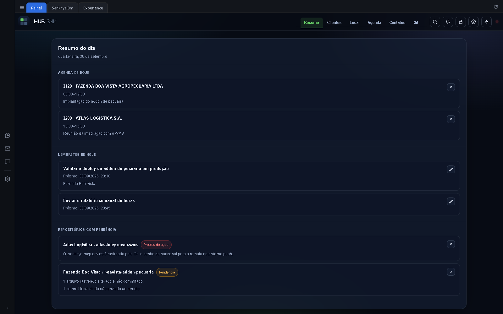
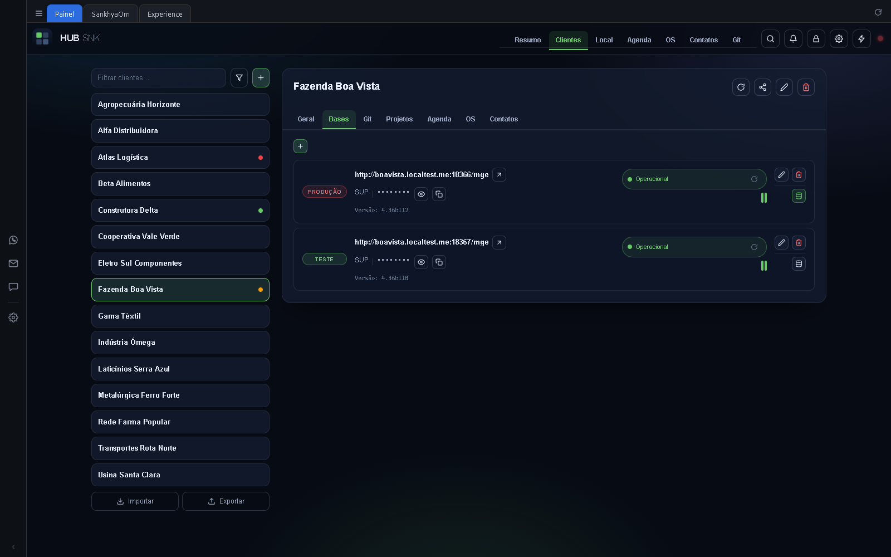

# HUB SNK

Hub local de cadastro de clientes, das bases e dos repositórios Git de cada
um, com o SankhyaOm e a Experience abertos em guias do próprio aplicativo. Roda
na sua máquina, sem Docker, sem banco de dados e sem conta para criar.

O cadastro nunca sai da sua máquina. O único envio de dados ao mantenedor é o
relato de problema, que leva seu nome, empresa e time (de Configurações), e só
quando você clica em **Enviar** — veja
[Relato de problema](docs/manutencao.md#relato-de-problema).

É um aplicativo desktop (Electron) só para Windows: a partir da versão 2 não há
distribuição para Linux nem para macOS.

Funcionalidades e download também em
**[carlossimao.github.io/hub-snk](https://carlossimao.github.io/hub-snk/)**.

---

## Instalação

Baixe o `HUB-SNK-Setup-<versão>.exe` na
[página de releases](https://github.com/CarlosSimao/hub-snk/releases) e rode.

- Instala só para o seu usuário, em `%LOCALAPPDATA%\Programs\HUB SNK`, **sem
  pedir administrador**.
- Não exige Node.js: o backend roda no Node que vem dentro do aplicativo.
- Cria os atalhos "HUB SNK" no menu Iniciar e na área de trabalho.
- Pergunta o seu **perfil profissional** — Consultor, Analista, Gerente de Projetos
  ou Desenvolvedor — e mostra uma caixa por funcionalidade, como a aba _Acessos_:
  trocar o perfil marca o preset dele, e as caixas podem ser ajustadas antes de
  seguir. A caixa **Terceiro**, independente do perfil, é para quem não tem acesso ao
  SankhyaOm nem à Experience: oculta Credenciais Sankhya, Agenda, OS e as guias dos
  dois sistemas. A escolha vale só como ponto de partida: depois da instalação, ajuste
  em _Configurações_ › _Acessos_, e reinstalar não desfaz o que você ajustou.
- Na primeira abertura, com o cadastro vazio, o painel abre na aba **Clientes** e,
  para quem não é Terceiro, com a janela de **Credenciais Sankhya** já aberta.
- O **Git AutoSync** (commit e push automáticos dos repositórios) não vem no
  instalador: tem licença própria. A aba **Git AutoSync** do painel o instala
  baixando da release do repositório dele, e exige o Git na máquina.

> O instalador não é assinado digitalmente. Na primeira execução, o SmartScreen
> pode mostrar _"O Windows protegeu o computador"_: clique em _Mais informações_ ›
> _Executar assim mesmo_.

### Atualizar e desinstalar

O HUB SNK se atualiza sozinho: procura versão nova ao abrir e a cada 6 horas,
baixa em segundo plano e avisa quando ela está pronta — clique no aviso, ou em
_Ajuda_ › _Reiniciar para atualizar_. Quem desligar _Ajuda_ › _Atualizar
automaticamente_ atualiza rodando o instalador da versão nova por cima. Para
desinstalar, use _Configurações_ › _Aplicativos_ › _HUB SNK_. Nos dois casos o cadastro não é
apagado; na desinstalação, se o Git AutoSync foi instalado pelo HUB SNK, o
instalador pergunta se ele sai junto.

---

## Como é o aplicativo

A janela tem guias no topo:

| Guia                | O que é                                                                                      |
| ------------------- | -------------------------------------------------------------------------------------------- |
| **Painel**          | O HUB SNK: Resumo do dia, clientes, bases, repositórios, ambiente local e agenda             |
| **SankhyaOm**       | O ERP, que loga sozinho com a credencial salva em Credenciais Sankhya                        |
| **Experience**      | A Experience, com o mesmo login automático                                                   |
| Uma por base aberta | Cada base de cliente abre na sua própria guia, isolada das outras, com o login já preenchido |

Onde os links do cadastro abrem — bases, repositórios, links gerais e links de
projeto — é uma escolha só, na aba **Geral** das configurações: numa guia do HUB
SNK ou no navegador padrão do sistema. O padrão é a guia do HUB SNK, onde a base
já abre com o login preenchido. Detalhes em
[Onde os links abrem](docs/funcionalidades.md#onde-os-links-abrem).

O menu _Guias_ esconde e mostra cada guia. `Ctrl+F` busca um texto na guia que
está na tela, como no Chrome.

À esquerda fica a barra de comunicação, com o **WhatsApp Web**, o **Gmail** e o
**Google Chat** abertos num painel por cima das guias, cada um com o próprio login
salvo e aviso de mensagem nova.

Fechar a janela não encerra o aplicativo: ele fica na bandeja do Windows, perto
do relógio. Para sair, use _Hub_ › _Sair_ ou o botão direito no ícone da bandeja.

---

## Configuração

O aplicativo não precisa de configuração: porta, endereço e pasta de dados são
fixos. Para quem desenvolve ou precisa mudar alguma coisa, estas variáveis de
ambiente valem antes de abrir o aplicativo:

| Variável                      | Padrão                               | O que faz                                                                      |
| ----------------------------- | ------------------------------------ | ------------------------------------------------------------------------------ |
| `HUB_DADOS_DIR`               | `%LOCALAPPDATA%\HubSnk\dados`        | Onde o cadastro é gravado                                                      |
| `SANKHYA_HUB_URL`             | `http://127.0.0.1:4100`              | Endereço do backend. A porta daqui é a porta em que o aplicativo o sobe        |
| `SANKHYA_DESKTOP_BRIDGE_PORT` | `4103`                               | Porta da ponte que o backend chama no aplicativo (cofre, agenda)               |
| `SANKHYA_HUB_BACKEND`         | `gerenciado`                         | `externo` faz o aplicativo usar um backend que já esteja no ar (`npm run dev`) |
| `SANKHYA_ERP_URL`             | `https://skw.sankhya.com.br/mge/`    | Endereço da guia SankhyaOm                                                     |
| `SANKHYA_EXPERIENCE_URL`      | `https://experience.sankhya.com.br/` | Endereço da guia Experience                                                    |

Rodando só o backend (`npm run dev`, veja [Manutenção](docs/manutencao.md)),
valem `HUB_PORTA` (padrão `4100`), `HUB_HOST` (padrão `127.0.0.1`, e só aceita
loopback), `HUB_DADOS_DIR` (padrão `./dados-hub-snk`) e `HUB_SEM_TOKEN` (`1`
desliga a exigência do token na API, para usar o painel no navegador sem o
aplicativo aberto — só em desenvolvimento).

Apontar a pasta de dados para dentro de uma pasta de nuvem é o que dá backup —
veja [Backup na nuvem](docs/funcionalidades.md#backup-na-nuvem).

---

## Segurança

O backend escuta só em `127.0.0.1`, e a razão é o que ele faz: devolve o
cadastro inteiro — senhas em texto puro incluídas — e abre programas do seu
computador (a IDE configurada, terminal, gerenciador de arquivos) a pedido de
quem chama a API. Um `HUB_HOST` fora do loopback é recusado na largada.

Toda a API exige o token que o aplicativo grava num arquivo da sua conta do
Windows, então outro programa da máquina — inclusive o de outro usuário do mesmo
computador — não lê o cadastro. O painel recebe o token do aplicativo sem nunca
vê-lo, e por isso só funciona dentro dele. O backend confere ainda se cada
requisição veio mesmo da própria máquina e recusa o resto — inclusive um site
aberto no seu navegador tentando falar com o programa. As rotas que só o
aplicativo chama (sessão da Experience, senha para o login automático,
encerramento) exigem o token no cabeçalho, que a tela não tem. Como as
conferências funcionam está em [docs/api.md](docs/api.md#autenticação).

As credenciais do Sankhya ERP e da Experience ficam no cofre do sistema
operacional, cifradas pelo aplicativo — nunca em texto puro.

---

## Onde ficam os dados

Tudo o que você cadastra fica em `%LOCALAPPDATA%\HubSnk\dados` — ou onde o
`HUB_DADOS_DIR` apontar. São o cadastro de clientes, a configuração global, as
bases e bancos da própria máquina, os lembretes, as notificações e o `sankhya.db`
com a Agenda de Recursos.

Os logs do aplicativo ficam em `%APPDATA%\HUB SNK\log` (`desktop.log` e
`backend.log`). O formato dos arquivos de dados está em
[docs/formato-dos-dados.md](docs/formato-dos-dados.md).

---

## Funcionalidades

| O quê                       | Resumo                                                                                                                               |
| --------------------------- | ------------------------------------------------------------------------------------------------------------------------------------ |
| **Cadastro de clientes**    | Bases do ERP com usuário, senha e banco vinculado, repositórios Git, links avulsos, projetos e anotações livres                      |
| **Guias do Sankhya**        | SankhyaOm e Experience dentro do aplicativo; cada base de cliente numa guia isolada, com usuário e senha preenchidos                 |
| **Agenda de Recursos**      | Consultada por uma janela oculta que loga no SankhyaOm sozinha, cruzada com a Experience no calendário de cada cliente               |
| **Resumo do dia**           | A tela inicial do Painel: agenda de hoje, lembretes do dia, repositórios com pendência e OS não concluídas, cada item com seu atalho |
| **Notificações**            | Sino do topo e aviso do Windows, com som e e-mail opcional: evento da agenda sem tarefa na Experience e lembretes                    |
| **Lembretes**               | Aba própria no menu: numa data ou recorrentes (cron), ligados a um cliente ou projeto, com aviso e e-mail opcional                   |
| **Kanban dos projetos**     | Um quadro por projeto; com o documento de escopo, o assistente de IA escolhido gera as tarefas. Arquivo JSON e servidor MCP          |
| **Importação de favoritos** | Transforma favoritos do Chrome, Edge, Opera, Firefox ou Safari em bases, deduzindo Produção ou Teste do nome                         |
| **Botões do repositório**   | Abrem a pasta, o terminal (rodando o script padrão) e a IDE configurada; e editam o `.sankhya-mcp.env` do MCP Claude                 |
| **Busca rápida**            | `Ctrl+K` no aplicativo ou `Ctrl+Shift+Espaço` em qualquer programa: acha cliente, base, repositório, link, contato ou atalho e abre  |
| **Buscar na página**        | `Ctrl+F` em qualquer guia, inclusive na Experience e no SankhyaOm: destaca as ocorrências e anda entre elas, como no Chrome          |
| **Comunicação**             | WhatsApp Web, Gmail e Google Chat na barra lateral, com aviso de mensagem nova; o contato abre a conversa ou um e-mail já endereçado |
| **Atalhos**                 | Lista de programas da sua máquina, iniciados com um clique pelo botão de raio, com busca a partir de seis cadastrados                |
| **Bases locais (Local)**    | Ligam, param e reiniciam o WildFly da sua máquina, com a situação do serviço, o log ao vivo e o `.sankhya-mcp.env` da instalação     |
| **Bancos locais (Local)**   | Ligam, param e reiniciam o container Docker do banco, conferindo se ele responde login com as credenciais cadastradas                |
| **Diagnóstico Git**         | Selo por repositório com a branch e a pendência mais grave — commit faltando, conflito, segredo rastreado —, atualizado sozinho      |
| **Git AutoSync**            | Opcional, instalado pela aba Git AutoSync: commit e push automáticos, também na seção AutoSync da aba Git do cliente                 |
| **Telas Flash**             | _Hub_ › _Compatibilidade com Flash (Ruffle)_ abre as telas Flex legadas do SankhyaOm, que pedem o Flash Player                       |
| **Backup na nuvem**         | Não é embutido: aponte a pasta de dados para o Drive, o OneDrive ou o Dropbox que você já usa                                        |

As bases e os bancos locais ficam no botão **Local**, no topo do painel, ao lado
de _Clientes_: é o ambiente de desenvolvimento da sua própria máquina, separado do
cadastro dos clientes. Ligar o banco sobe o Docker antes, se ele estiver parado,
e parar o WildFly usa o desligamento limpo do próprio servidor, não um
encerramento forçado.

Cada uma em detalhe, com as regras, em
[docs/funcionalidades.md](docs/funcionalidades.md).

> Os arquivos da pasta de dados sobem para a nuvem **como estão no disco**, e o
> cadastro guarda as senhas das bases e dos bancos em texto puro. Confira se a
> pasta não está compartilhada com ninguém.

---

## Solução de problemas

| Sintoma                                                                                      | O que fazer                                                                                                                                                                                                                                                                      |
| -------------------------------------------------------------------------------------------- | -------------------------------------------------------------------------------------------------------------------------------------------------------------------------------------------------------------------------------------------------------------------------------- |
| _"HUB SNK — o backend não subiu"_ ao abrir                                                   | Com _"A porta 4100 já está em uso por outro programa, que não é o backend do HUB SNK"_, feche esse programa e abra o HUB SNK de novo: o aplicativo não usa um backend que não é dele. Sem essa frase, o backend falhou, e as últimas linhas estão na mensagem e em `backend.log` |
| _"HUB SNK — a ponte com o backend não abriu"_ ao abrir                                       | A porta 4103 está ocupada por outro programa. Credenciais Sankhya, Agenda e login automático ficam indisponíveis até você fechar esse programa e abrir o HUB SNK de novo                                                                                                         |
| O painel não carrega nada e o log do backend mostra _"Requisição sem token válido recusada"_ | O painel foi aberto fora do aplicativo, num navegador comum. Ele só funciona dentro do HUB SNK, que entrega o token da API à guia Painel                                                                                                                                         |
| A agenda diz que o login automático falhou ou que não há usuário e senha salvos              | Confira o usuário e a senha do SankhyaOm em Credenciais Sankhya e tente de novo                                                                                                                                                                                                  |
| A agenda diz _"login automático suspenso: ..."_, ou as guias pararam de logar sozinhas       | O Sankhya recusou a senha salva duas vezes seguidas, e o login automático parou para não bloquear a conta. Salve usuário e senha de novo em Credenciais Sankhya (ou reabra o aplicativo)                                                                                         |
| Os botões de Git não fazem nada                                                              | O `git` precisa estar no PATH. Confira com `git --version` num terminal novo                                                                                                                                                                                                     |
| Mensagem sobre esquema mais novo ao iniciar                                                  | O cadastro foi gravado por uma versão mais nova do HUB SNK. Instale a versão mais recente                                                                                                                                                                                        |

Se não estiver na lista, [abra uma issue](https://github.com/CarlosSimao/hub-snk/issues/new/choose)
citando a versão que aparece no rodapé da tela, e sem colar senha, host,
usuário ou nome de cliente: o repositório é público.

---

## Documentação técnica

Nada disto é necessário para usar o HUB SNK.

- [Funcionalidades em detalhe](docs/funcionalidades.md) — cada recurso, com as regras
- [API HTTP](docs/api.md) — as rotas, os corpos aceitos e a conferência de origem
- [Formato dos arquivos de dados](docs/formato-dos-dados.md) — o envelope, o esquema e a migração
- [Distribuição](docs/distribuicao.md) — como o aplicativo desktop e o instalador são montados
- [Estrutura do código](docs/estrutura-do-codigo.md) — mapa dos arquivos
- [Manutenção](docs/manutencao.md) — modo de desenvolvimento, padrões do código, regra de versão, roteiro de teste e publicação
- [CHANGELOG](CHANGELOG.md) — o que mudou em cada versão

---

## Licença

[MIT](LICENSE) — use, altere e distribua à vontade, sem garantia nenhuma.
